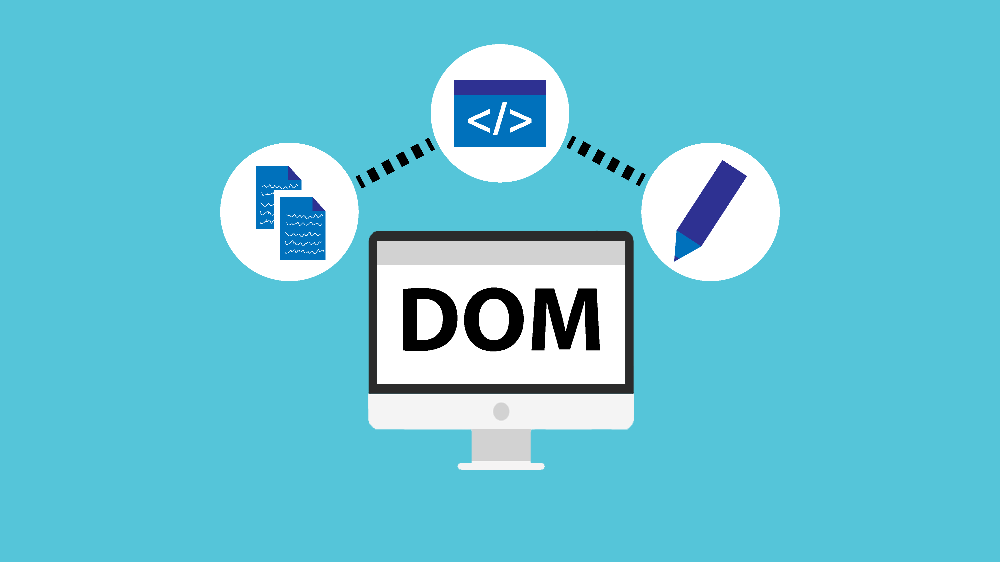
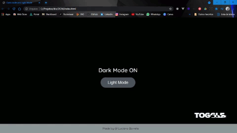

    

<h1 align="center">
  Toggle
</h1>

 

<h2 align="center">Estrutura simples de um Toggle manipulando a DOM, utilizando HTML, CSS e Javascript</h2>

 

  <kbd></kbd>

 

  <kbd>

 
  

  <kbd>

 
  

  <kbd>

 

## :memo: Licença

<h5 align="center">Esse projeto está sob a licença MIT. Veja o arquivo LICENSE para mais detalhes.</h5>

  
  

---

  

  
    

